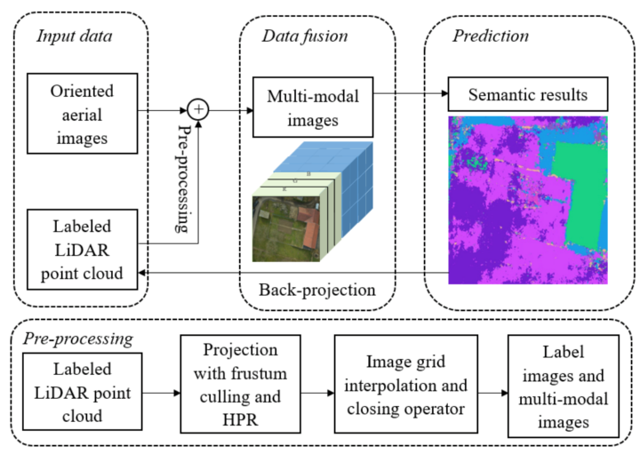
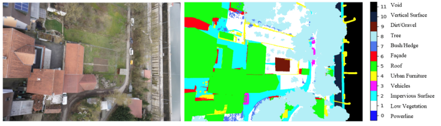
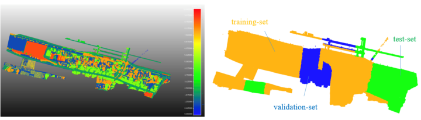

# Implicit Joint Semantic Segmentation of Images and Point Cloud

Website: https://www.ifp.uni-stuttgart.de/lehre/masterarbeiten/581-shu/

#### keywords: Deep learning, semantic segmentation, ALS point cloud, aerial imagery, multi-modal features

```
Master Thesis at Insititute of Photogrammetry (Ifp), University of Stuttgart, Germany
Author: Fangwen Shu
Betreuer: M.Sc. Dominik Laupheimer
Prüfer: Prof. Norbert Haala

framework: keras 2.0
pre-processing: python3
semantic segmentation: python2

End in 01.04.2019
```

This is a student work, the prototype code is open-sourced in the hope that it will be useful,
 * but WITHOUT ANY WARRANTY; without even the implied warranty of
 * MERCHANTABILITY or FITNESS FOR A PARTICULAR PURPOSE.

## The Workflow:
 

### Ground Truth Aerial Imagery and LiDAR Point Cloud:
 

 

## Courtesy for the Dataset:

The Hessigheim 3D (H3D) benchmark on semantic segmentation of high-resolution 3D point clouds and textured meshes from UAV LiDAR and Multi-View-Stereo.

https://ifpwww.ifp.uni-stuttgart.de/benchmark/hessigheim/Default.aspx

Please cite if you use the dataset for your research:

```
@article{KOLLE2021100001,
         title = {The Hessigheim 3D (H3D) benchmark on semantic segmentation of high-resolution 3D point clouds and textured meshes from UAV LiDAR and Multi-View-Stereo},
         journal = {ISPRS Open Journal of Photogrammetry and Remote Sensing},
         volume = {1},
         pages = {11},
         year = {2021},
         issn = {2667-3932},
         doi = {https://doi.org/10.1016/j.ophoto.2021.100001},
         url = {https://www.sciencedirect.com/science/article/pii/S2667393221000016},
         author = {Michael Kölle and Dominik Laupheimer and Stefan Schmohl and Norbert Haala and Franz Rottensteiner and Jan Dirk Wegner and Hugo Ledoux},
} 
```